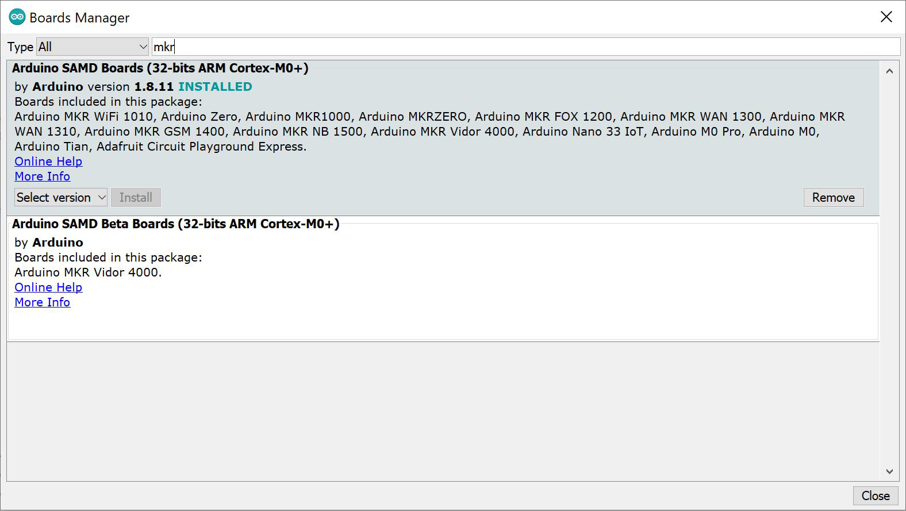

# Cluecon 2021 Arduino Challenge 1
Using an Arduino board, and sensors create a solution that will detect impact or metrics from dropping an egg on a target.  You can use your imagination and any code snippets provided to aid in your quest.   There are many different ways to solve the objective, Be creative and have fun with it!

Extra consideration, if you make a actual egg dropper or wow us with something fancy!

## About Cluecon 2021 Arduino Challenge 1
For this challenge you will demonstrate your technical skills to measure the impact of a dropping egg.

## Getting Started
- [x] Arduino IDE
- [x] Putty or Similar for opening serial port
- [x] Arduino MKR WiFi 1010 or Similar
- [x] Force Sensing Resistor or Switch
- [x] Micro USB Cable
- [x] Jumper/Hookup Wires

## Cluecon 2021 Arduino Challenge 1 - How It Works
When the force sensing resistor or switch is pressed you can detect impact and/or the level of impact.

We have included a sample target graphic to hook up to your button or sensor.  We suggest using some cardboard to make a sturdy surface for your target.

## Let's Get Started 
Prepare Your Coding Enviroment
1. Install Arduio IDE 
- [Installing Arduino IDE](https://www.arduino.cc/en/guide/windows)
2. Then open and goto Tools -> Boards -> Boards Manager
3. Type in 'MKR' and make sure that 'Arduino SAMD Boards (32-bits ARM Cortex-M0+)' is Installed, If not click install

4. Take inventory and prepare your sensors for what you need
5. Code! - There are examples included, to get you started, and we are here to help.

# More Documentation
You can find more documentation on LaML, Relay, and all Signalwire APIs at:
- [SignalWire API Docs](https://docs.signalwire.com)
- [SignalWire Github](https://gituhb.com/signalwire)
- [Arduino IDE](https://www.arduino.cc/en/guide/windows)
- [PuTTY Client](https://www.chiark.greenend.org.uk/~sgtatham/putty/latest.html)

# Support
If you have any issues or want to engage further about this Signal, please [open an issue on this repo](../../issues) or join our fantastic [Slack community](https://signalwire.community) and chat with others in the SignalWire community!

If you need assistance or support with your SignalWire services please file a support ticket from your Dashboard. 

